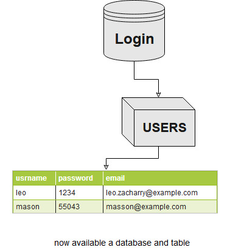

## Creating New Database & Table
**Step 1**  Creat a new storage folder -> ```example (c:/databases)```

**Step 2**  Creat a new database in storage folder  
> 	 CREATE DATABASE Login ;

**Step 3**  Creat a new table in database (**Login**)
> 	  CREATE TABLE Users COLUMN ["username","password","email"] VALUE ["leo","1234","leo.zacharry@example.com"];




##  EXPLAIN Querys

``` "UNIQUE COLUMN"       :  the data returned only (UNIQUE) values in the selected column. ```   

``` "SELECT TABLE"        :  the data returned is stored in a result table ``` 

``` "SELECT TABLE COUNT"  :  the data returned number of result in the table ``` 

``` "SELECT TABLE COLUMN" :  the data returned selected columns in the table ``` 

``` "SELECT TABLE LIMIT"  :  the data returned specify the number of records (range 0-1) ``` 

``` "SELECT TABLE FIND"   :  finds rows that contain a specific string value in a column. ``` 
    
``` "UPDATE ROW"          :  modify the existing records in a data table. ```    

``` "ADD ROW"             :  insert new record in a data table. ```  

``` "ADD COLUMN"          :  create new column in a data table. ```   

``` "RENAME TABLE"        :  to rename a table in data. ```     

``` "RENAME DATABASE"     :  to rename a data. ```           

``` "RENAME COLUMN"       :  to rename a column in table. ```    

``` "DELETE COLUMN"       :  to delete a column in a table ```  

``` "DELETE ROW"          :  to delete a selected record in a table  ```   
        
``` "CREATE TABLE"        :  create a new table in a data ``` 

``` "CREATE DATABASE"     :  create a new database ```   

``` "DROP DATABASE"       :  to delete a database ```   

``` "DROP TABLE"          :  to delete a table ```    

``` "LIST DATABASE"       :  to list database names ```    

``` "LIST TABLE"          :  to list table in database ``` 


## Example Referances

``` UNIQUE COLUMN <COLUMN_NAME> TABLE <TABLE_NAME>; ```

``` SELECT TABLE <TABLE_NAME>; ```

``` SELECT TABLE <TABLE_NAME> COUNT;  ```

``` SELECT TABLE <TABLE_NAME> COLUMN ["COL1"]; ```

``` SELECT TABLE <TABLE_NAME> LIMIT ["0","10"]; ```

``` SELECT TABLE <TABLE_NAME> COLUMN ["COL1"] FIND ["SEARCH_STRING"];  ```

``` UPDATE ROW <TABLE_NAME> COLUMN ["COL1","COL2"] VALUE ["VAL1","VAL2"] FIND ["COL1","SEARCH_STRING"]; ```

``` ADD ROW <TABLE_NAME> COLUMN ["COL1","COL2","COL3"] VALUE ["VAL1","VAL2","VAL3"];  ```

``` ADD COLUMN ["COL1","COL2","COL3"] TABLE <TABLE_NAME>;  ```

``` RENAME TABLE ["TABLE"] VALUE ["NEW_NAME"];  ```

``` RENAME DATABASE ["DATABASE_NAME"] VALUE ["NEW_NAME"];  ```

``` RENAME COLUMN ["COL1","COL2"] TABLE <TABLE_NAME> VALUE ["NEW_1","NEW_2"];  ```

``` DELETE COLUMN <COLUMN_NAME> TABLE <TABLE_NAME>;  ```
    
``` DELETE ROW <TABLE_NAME> COLUMN <COLUMN_NAME> VALUE ["STRING"]; ```
    
``` CREATE TABLE <TABLE_NAME> COLUMN ["COL1","COL2","COL3"] VALUE ["VAL1","VAL2","VAL3"]; ```
    
``` CREATE DATABASE <DATABASE_NAME>; ```
    
``` DROP DATABASE <DATABASE_NAME>; ```
    
``` DROP TABLE <TABLE_NAME>; ```
    
``` LIST DATABASE; ```
    
``` LIST TABLE <DATABASE_NAME>; ```


##  Help file
 + query help for dummies.pdf
 + query help for dummies.docx
