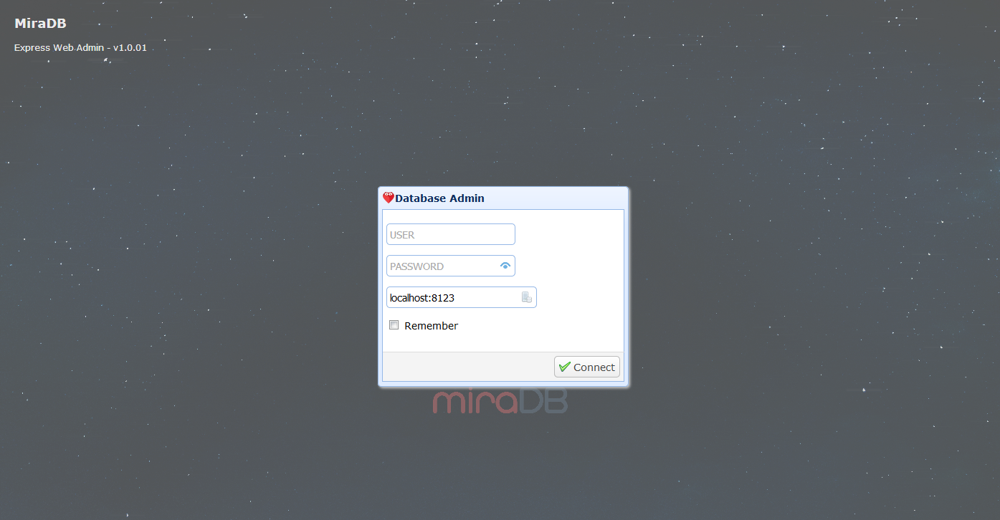
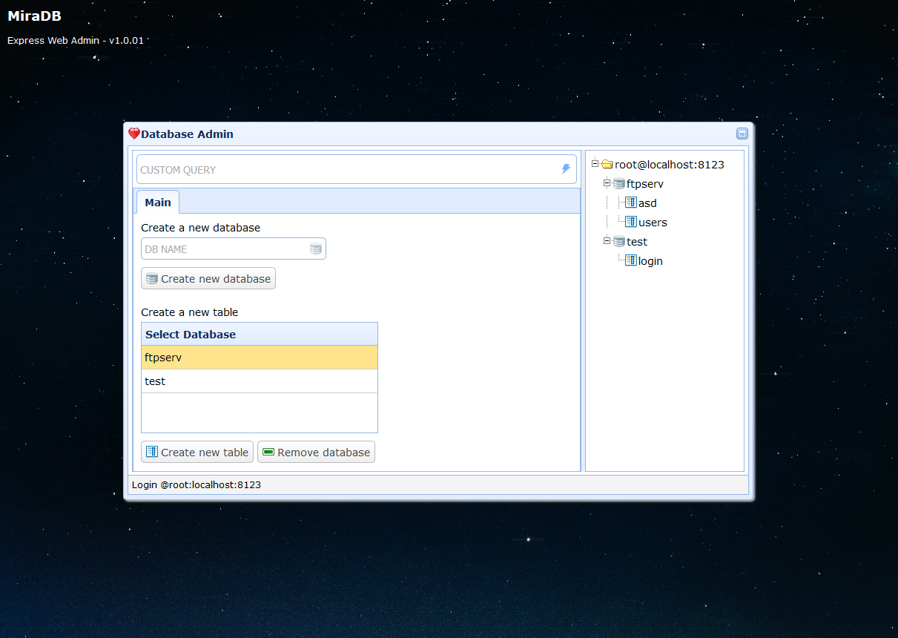
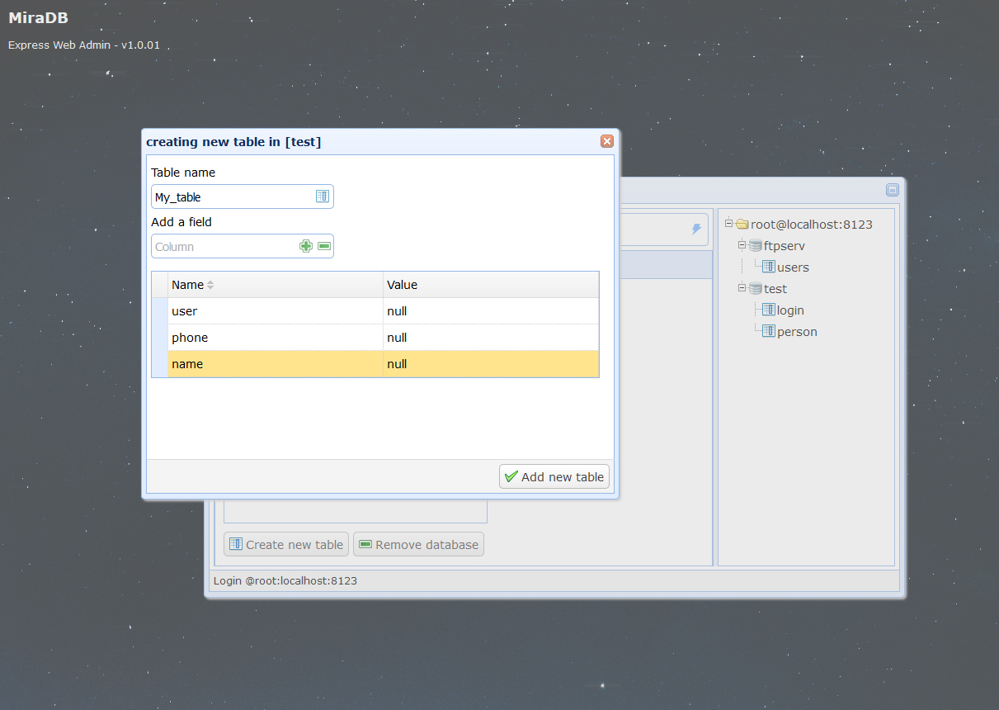

## Mira Web Admin Interface

MIRA DATABASE ``` INSTALL ``` [EXPRESS SERVER](https://git.io/fpvol "SERVER")

**DB ADMIN LINUX INSTALL**

* cd /home/miradb/public
* sudo wget https://github.com/Nodeclient/Mira-DB/raw/master/WEB_ADMIN/public_web_admin.tar.gz
* sudo tar xvzf public_web_admin.tar.gz
	
**DB ADMIN WINDOWS INSTALL**

* cd c:/miradb/public
* [Download Web Admin](https://github.com/Nodeclient/Mira-DB/raw/master/WEB_ADMIN/public_web_admin.tar.gz "dgf")
* unrar -> public_web_admin.tar.gz
	
**DB ADMIN WEB INTERFACE**

	http:127.0.0.1:8123/


**ADMIN INTERFACE (SCREEN)**








**YOUTUBE TUTORIAL**

 	https://www.youtube.com/watch?v=HLzz94MpW4g